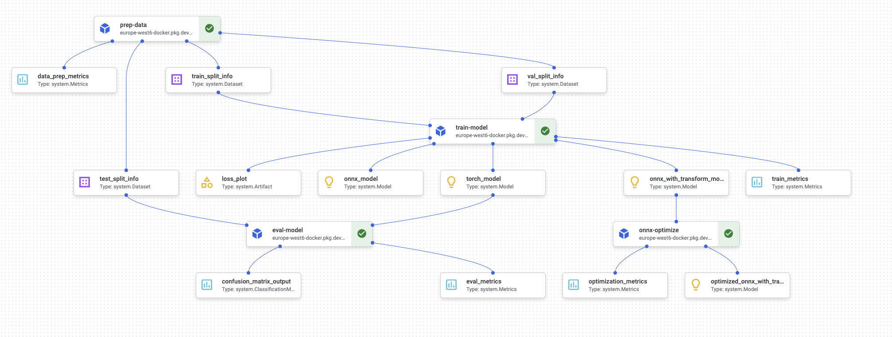
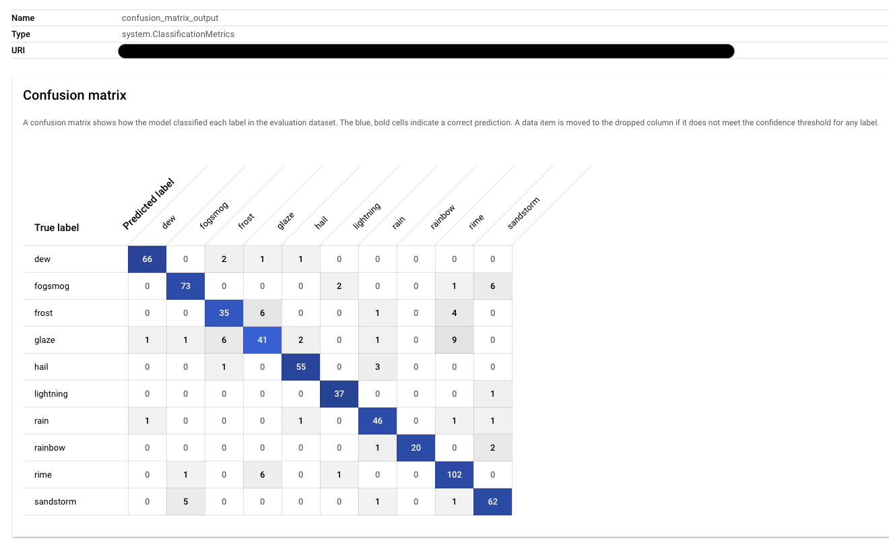
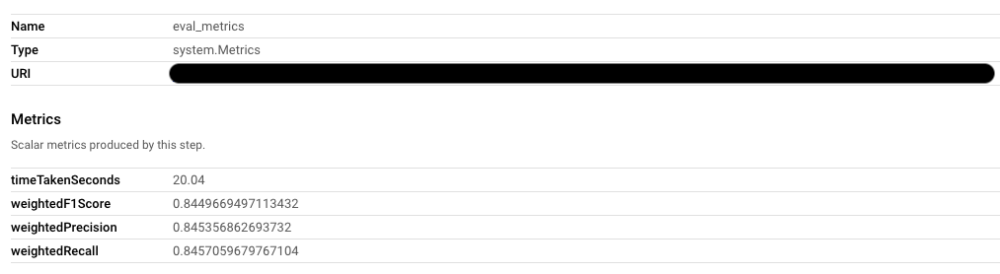
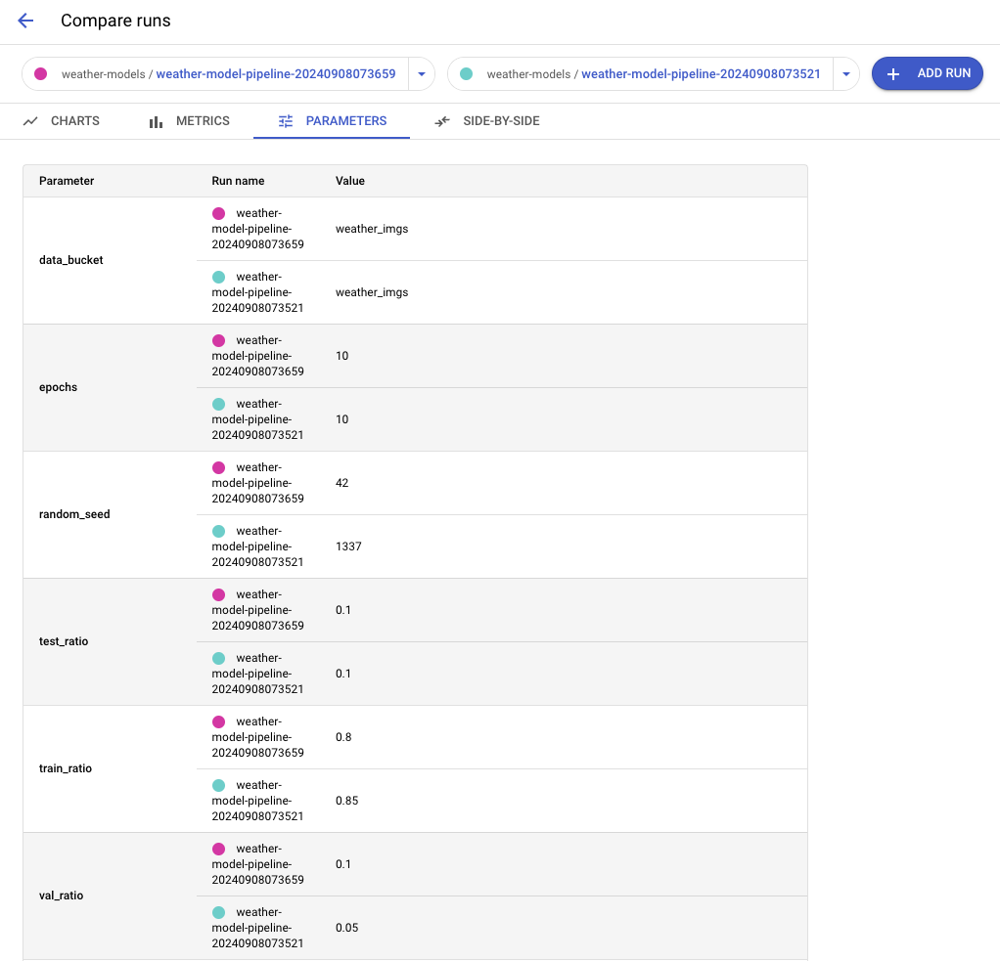
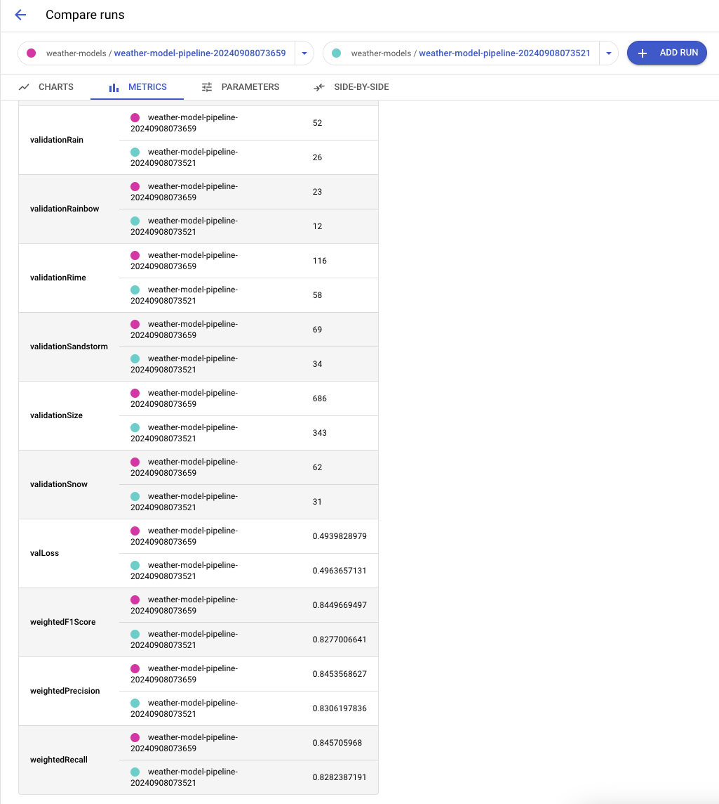
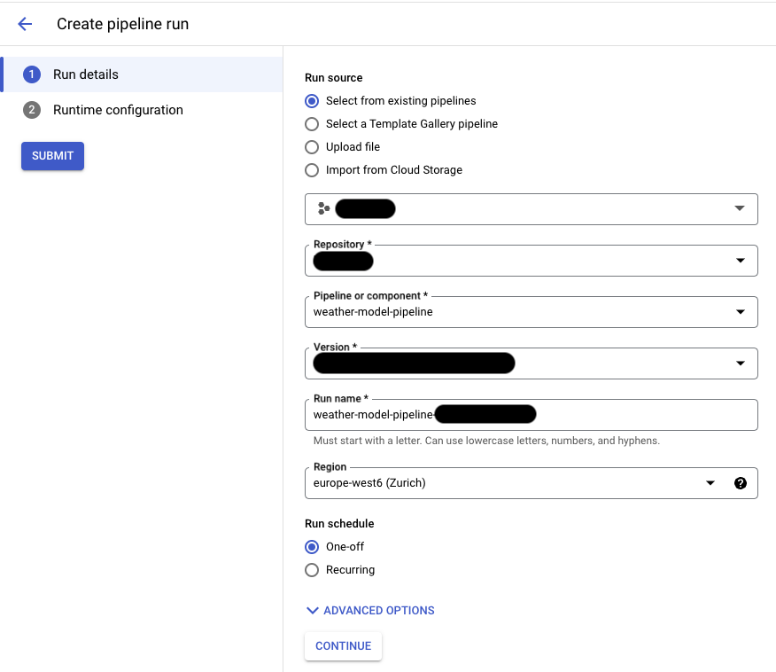
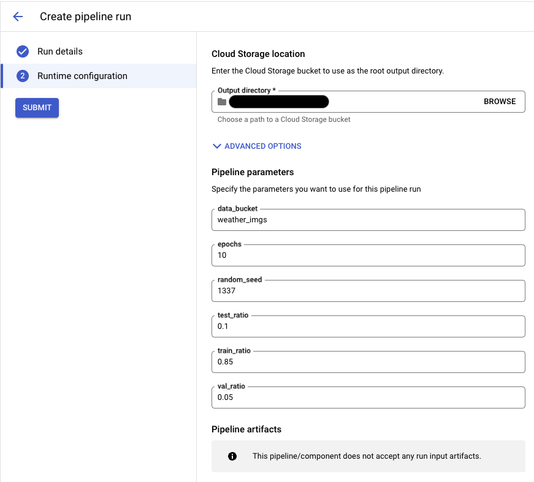

# ML Workflows

This repository showcases an implementation of model training
[pipeline](https://www.kubeflow.org/docs/components/pipelines/overview/). Although the project is
using [Kubeflow Pipelines (KFP)](https://www.kubeflow.org/docs/components/pipelines/), [Google Cloud Platform (GCP)](https://cloud.google.com/docs)
and [weather image classification dataset](https://www.kaggle.com/datasets/jehanbhathena/weather-dataset) for this case
study, the focus is on demonstrating key concepts like reproducibility, artifact tracking, and automation, rather than
the specifics of tools and implementation details.

Disclaimer — this project doesn't advocate for Kubeflow Pipelines as the definitive framework for developing machine
learning workflows (alternative frameworks will be provided in the appendix), nor does it endorse Vertex AI as the
optimal managed platform. The choice of these specific tools stems from pragmatic reasons — namely, their immediate
availability in my existing setup or compatability with existing setup.

The `ml-workflows` follows a `standard` project structure, as well as tooling, proposed in the
repository [py-manage](https://github.com/martynas-subonis/py-manage).

## Table of Contents

- [Hypothetical Problem Statement](#hypothetical-problem-statement)
- [Pipeline Overview](#pipeline-overview)
- [Artifact Examples](#artifact-examples)
- [Prerequisites](#prerequisites)
- [Compile and Upload Pipeline Template](#compile-and-upload-pipeline-template)
- [Creating Pipeline Run From Your Template](#creating-pipeline-run-from-your-template)
- [Porting Pipeline Template to Different Platforms](#porting-pipeline-template-to-different-platforms)
- [Appendix](#appendix)

## Hypothetical Problem Statement

Let’s assume we are running a renewable energy company that seeks to optimize solar and wind farm operations across
diverse geographic locations. By implementing an AI system that can automatically recognize weather conditions from
images captured by on-site cameras, we can predict energy output more accurately and adjust operations in real-time.
This weather recognition capability would enable more efficient resource allocation and improve overall energy
production forecasting.

For this problem, we've acquired a
[“Weather Image Recognition”](https://www.kaggle.com/datasets/jehanbhathena/weather-dataset) dataset that we believe
will meet our needs. Our goal is to create a model capable of predicting 11 distinct weather conditions: dew, fog/smog,
frost, glaze, hail, lightning, rain, rainbow, rime, sandstorm, and snow. This diverse range of weather phenomena will
allow our AI system to provide comprehensive insights for optimizing our renewable energy operations.

The aim of our project is to develop a robust model training pipeline that researchers and engineers can easily
reuse with different runtime parameters. This template should accommodate varying data sources, data splits, random
seeds, training epochs etc. The pipeline should guarantee reproducibility and ease of artifact tracking, as well
as a high level of automation.

## Pipeline Overview



The [pipeline](template.py) consists of three main components:

1. Data Preparation ([data_prep](data_prep)):

-
    - Splits the dataset into train, validation, and test sets.
-
    - Uses stratified sampling to maintain class distribution.
-
    - Outputs: train, validation, and test split information.

2. Model Training ([train](train)):

-
    - Implements reproducibility measures.
-
    - Uses MobileNetV3-Small architecture with transfer learning.
-
    - Fine-tunes the classifier head for the specific problem domain.
-
    - Outputs: trained PyTorch model, ONNX model, training metrics, and loss plot.

3. Model Evaluation ([eval](eval)):

-
    - Evaluates the model on the test set.
-
    - Calculates evaluation metrics.
-
    - Outputs: confusion matrix, weighted precision, recall, and F1-scores.

Each component has its own Docker image, ensuring a reproducible runtime environment through the use
of [Poetry](https://python-poetry.org/docs/) and its `.lock` files. To guarantee consistency in results, all components
employ fixed random seeds for randomized algorithms. Additionally, the training component includes
extra [PyTorch reproducibility](https://pytorch.org/docs/2.3/notes/randomness.html#reproducibility) measures.

By default, component result caching is enabled, meaning components are not re-executed unless their input parameters or the components
themselves are modified. For example, this would allow for adjustments to the evaluation code without the need for time-consuming
retraining.

## Artifact Examples

### Confusion Matrix



### Evaluation Metrics



### Comparison Between Different Pipeline Runs

If we add pipeline runs of interest
to [Vertex AI Experiment](https://cloud.google.com/vertex-ai/docs/experiments/intro-vertex-ai-experiments), we can get
side-by-side comparisons for free:




## Prerequisites

The implementation of this pipeline template/pipeline run is coupled with GCP. In order to be able to compile/upload the
pipeline template, as well as create a pipeline run from the template, one has to:

- Have a [GCP project](https://cloud.google.com/docs).
- Enable [Vertex AI](https://cloud.google.com/vertex-ai) API.
- Have a [GCS](https://cloud.google.com/storage) bucket,
  with ["Weather Image Recognition"](https://www.kaggle.com/datasets/jehanbhathena/weather-dataset) dataset uploaded. In
  code, its `data_bucket` parameter to the pipeline, which defaults to `"weather_imgs"`. Use your bucket name here.
- Have a GCS staging bucket, where Kubeflow Pipelines can persist its artifacts.
- Have a Docker type repository in [Artifact Registry](https://cloud.google.com/artifact-registry/docs), where built
  images of components are pushed.
- Have a Kubeflow Pipelines type repository in Artifact Registry, where templates of pipelines are pushed.
- Have [gcloud cli](https://cloud.google.com/sdk/docs/install) installed.
- Correctly configure/authorize `gcloud`:

```bash
gcloud config set project $GCP_PROJECT
gcloud auth application-default login
```

- Have a local `.env` file with the following `env` variables set:

```text
KFP_REPOSITORY=  # Your Kubeflow Pipelines type repository in Artifact Registry
STAGING_BUCKET=  # Your GCS bucket, where Kubeflow Pipelines will persist its artifacts.
PREP_DATA_DOCKER_URI=  # Your URI of data_prep component Docker image. 
TRAIN_MODEL_DOCKER_URI=  # Your URI of train component Docker image.
EVAL_MODEL_DOCKER_URI=  # Your URI of eval component Docker image.
```

- Have [Poetry installed](https://python-poetry.org/docs/#installation).
- Have Python `~3.12` active in the project directory (using [pyenv](https://github.com/pyenv/pyenv) is advised).

## Compile and Upload Pipeline Template

With the [prerequisites](#prerequisites) met, compiling and uploading the pipeline template should be as simple as:

```bash
poetry install
poetry run pipeline
```

## Creating Pipeline Run From Your Template

To create a pipeline run from the uploaded pipeline template, just follow the
[official Vertex AI documentation](https://cloud.google.com/vertex-ai/docs/pipelines/create-pipeline-template#create-pipeline-run-from-template).




## Porting Pipeline Template to Different Platforms

If the new platform offers a [KFP-conformant backend](https://www.kubeflow.org/docs/components/pipelines/overview/),
porting the kfp pipeline to another platform should be straightforward. The main modification involves adjusting
the data fetching logic in the `data_prep`, `train`, and `eval` components, where the `google.cloud.storage.Client` is
currently used.

## Appendix

Other frameworks for building machine learning workflows besides Kubeflow Pipelines:

- [Flyte](https://github.com/flyteorg/flyte)
- [Metaflow](https://github.com/Netflix/metaflow)
- [Prefect](https://github.com/PrefectHQ/prefect)
